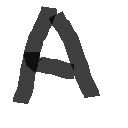
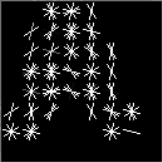
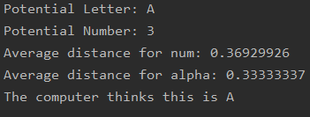

# Letter Recognition

 <b>Current State</b>: Can recognize numbers and letters but we need to figure out how to make it more accurate

<strong>Latest Change</strong>: Now using HOG Features instead of pixel value features for improved accuracy 

 
How it works:
-------------
<h> We will take advantage of a supervised learning technique known as KNearestNeighbor (KNN) <h>
 
<b>Step 1: Collect Data & Train </b>
 

   
Read from the thousands of training images stored in our TrainingImages folder
 
   
Extract HOG features from these training images 
 
   
Organize image features into 1d array and create a corresponding 1d label array 

   
Save the training data in .npz file for easy and faster access later 

   
Note: Training can take up to 3 minutes depending on the number of training images chosen

 

<b>Step 2: Train KNN "Model" </b>

   
Load the training information stored in .npz file

   
Create a KNN object and train it (built in OpenCV class and methods) 

<b>Step 3: Reap the reward </b>
 

  
Once the training is done, we can read our test image, extract its HOG features, and find its nearest feature neighbors (built in OpenCV method) 

 

 <b> Example Input Image: </b> 
-------------

 

-------------
<b> Example Input HOG Features: </b>
-------------

-------------
<b> Example Output: </b> 
-------------

